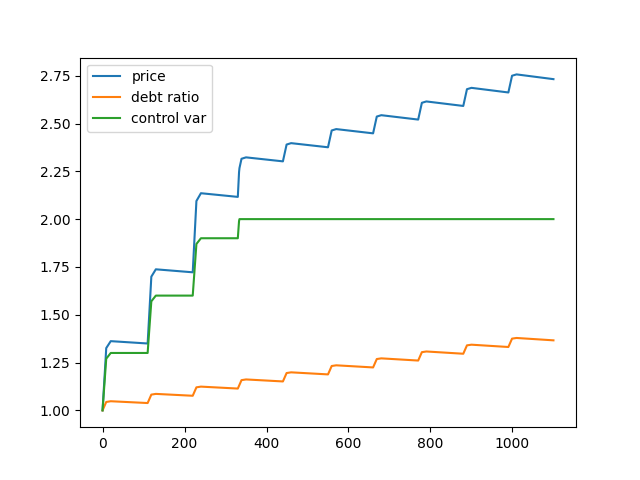

# Vader Bond

### Install

```shell
# install virtualenv
python3 -m pip install --user virtualenv
virtualenv -p python3 venv
source venv/bin/activate

pip install eth-brownie
pip install matplotlib
pip install numpy

brownie pm install OpenZeppelin/openzeppelin-contracts@3.4.2

npm i
npm i -g ganache-cli
```

### Test

```shell
brownie test tests/path-to-test-file-or-folder -s -v
```

### Simulation

##### Increasing bond price


##### Decreasing bond price


### Misc

```shell
pip3 install solc-select

# select solc compiler
solc-select install 0.7.6
solc-select use 0.7.6

# check code size (max 2457 bytes)
brownie compile -s
```
